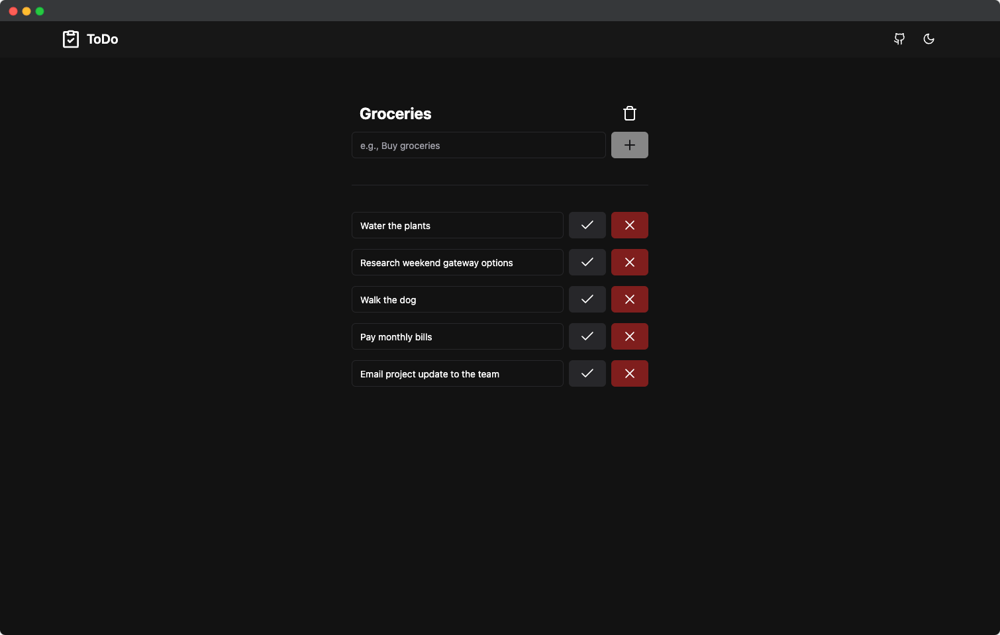

# ToDo App

ToDo is a user-friendly web application designed to help you stay organized and manage your tasks effectively.

## Table of Contents

- [Features](#features)
- [Technologies Used](#technologies-used)
- [Quick Start Guide](#quick-start-guide)
- [Join The Collaboration](#join-the-collaboration)
- [Contact](#contact)
- [License](#license)

## Features

- **Effortless Task Management:** Add, edit, and mark tasks as complete seamlessly. Clear completed tasks to keep your list clutter-free.

- **Smooth Transitions:** Enjoy fluid transitions while interacting with tasks, enhancing the user experience.

- **Responsive Design:** Whether on desktop or mobile, manage tasks effortlessly with a consistent and user-friendly interface.

- **Day and Night Modes:** Choose light or dark mode for comfortable usage, day or night.

- **Automatic Reordering:** Completed tasks move to the bottom, ensuring active tasks stay accessible and organized.

- **Reset with Ease:** Clear your entire to-do list in a single click, providing a fresh start whenever you need it.

## Technologies Used

- [SvelteKit](https://svelte.dev/): A progressive framework for building efficient and high-performance web applications.

- [TypeScript](https://www.typescriptlang.org/): A superset of JavaScript that adds static typing and other features to the language.

- [Tailwind CSS](https://tailwindcss.com/): Utility-first CSS framework for rapid and flexible styling.

- [shadcn-svelte](https://www.shadcn-svelte.com/): An unofficial port of [shadcn/ui](https://github.com/shadcn-ui/ui) for Svelte/SvelteKit.

## Quick Start Guide

1. Begin by cloning this repository to your local machine.
2. Install the necessary dependencies by running `npm install`.
3. Launch the development server with `npm run dev`.
4. Access the application by opening your web browser and navigating to the port specified in the console.

## Join The Collaboration

Collaboration for bug fixes, enhancements, and new features is welcomed! If you're interested in contributing to the development of the ToDo App, please adhere to the following contribution guidelines:

1. Start by forking the repository to your own GitHub account.
2. Clone the forked repository to your local machine.
3. Create a new branch dedicated to your feature or bug fix, e.g., `git checkout -b feature-name`.
4. Implement your changes and commit them using a descriptive message, such as `git commit -m "Explanation of your changes"`.
5. Share your modifications with your forked repository: `git push origin feature-name`.
6. Craft a pull request on the original repository, outlining the nature and purpose of your changes.

Let's collaborate effectively to elevate the ToDo App's quality together!

## Contact

For questions or feedback, reach out to [Julian Rocha](https://julianrocha.dev).

## License

This project is licensed under the [MIT License](LICENSE).
